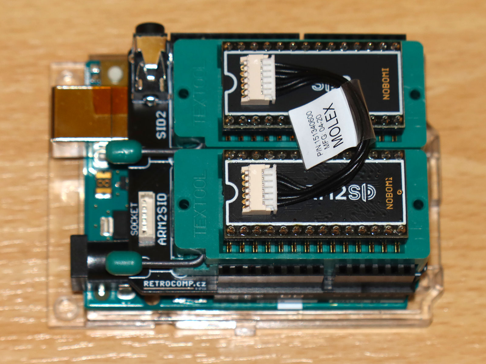
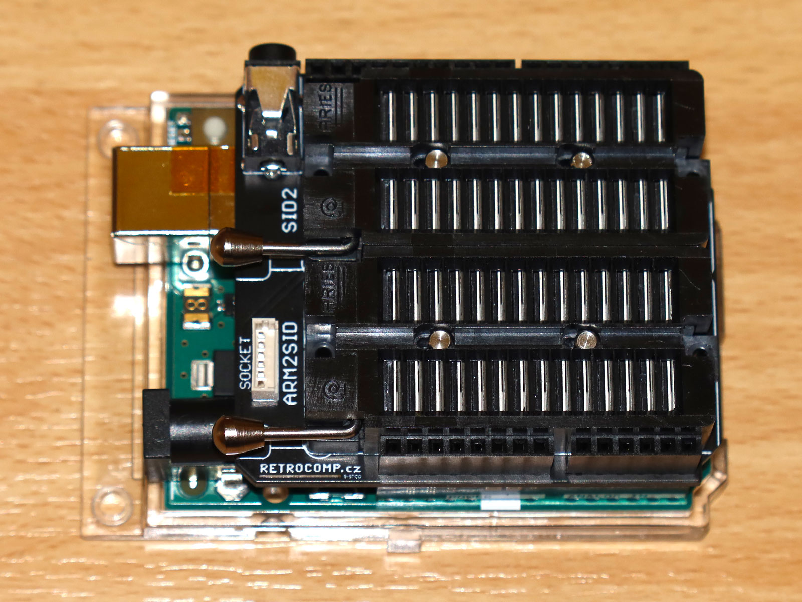
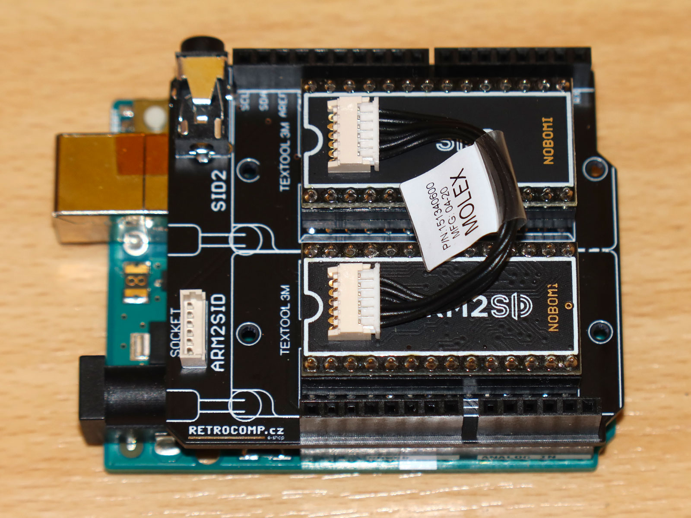
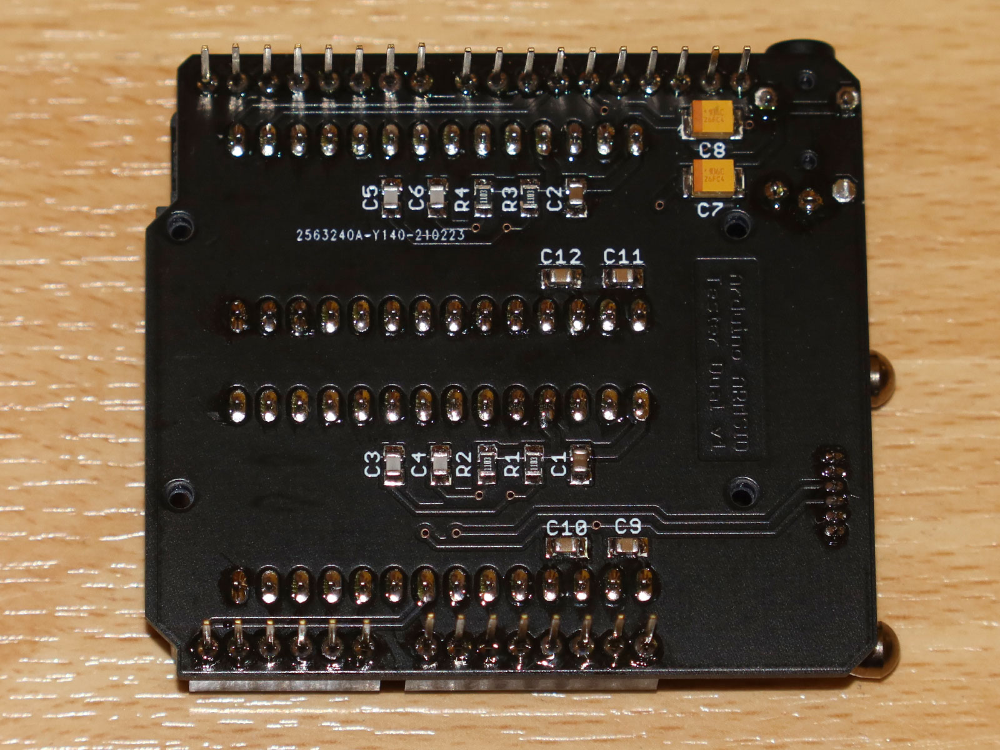
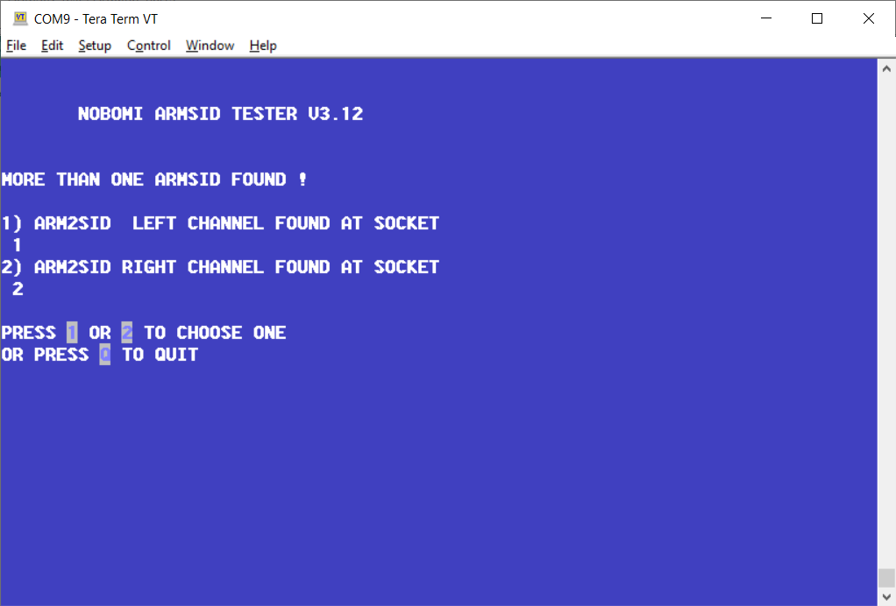
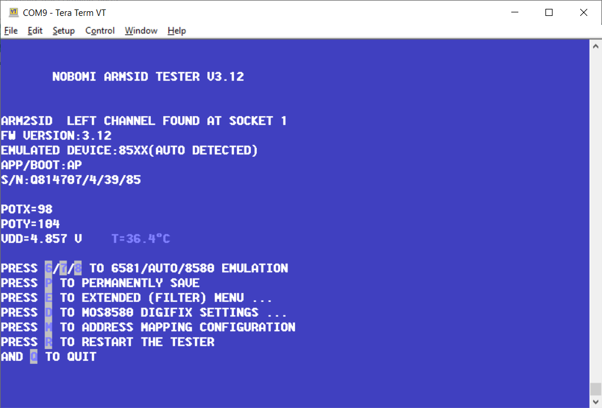
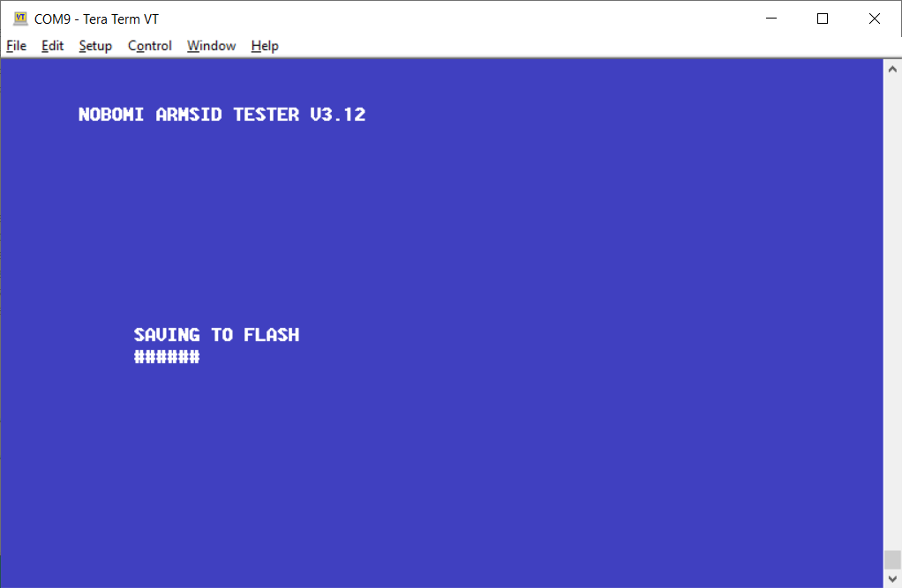
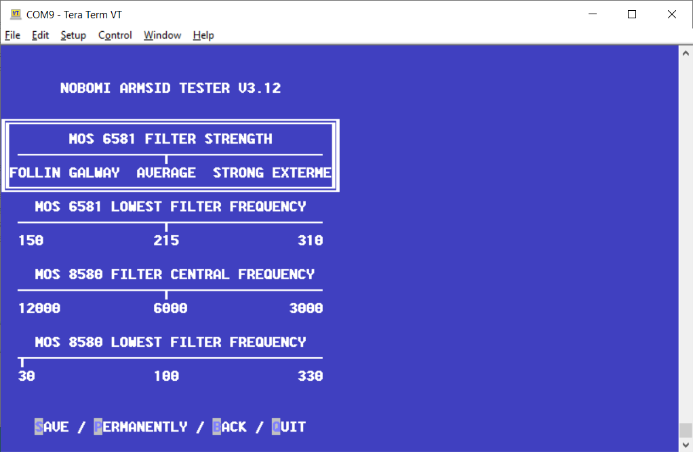
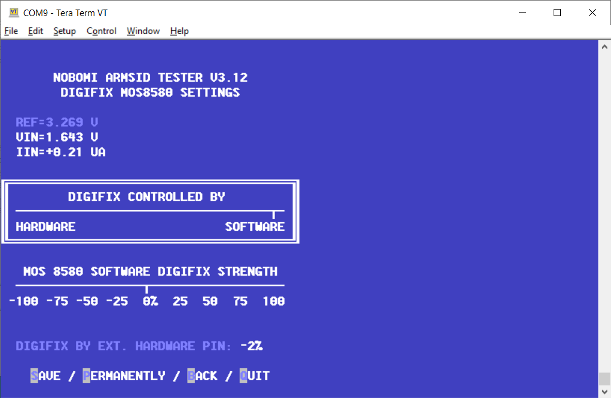
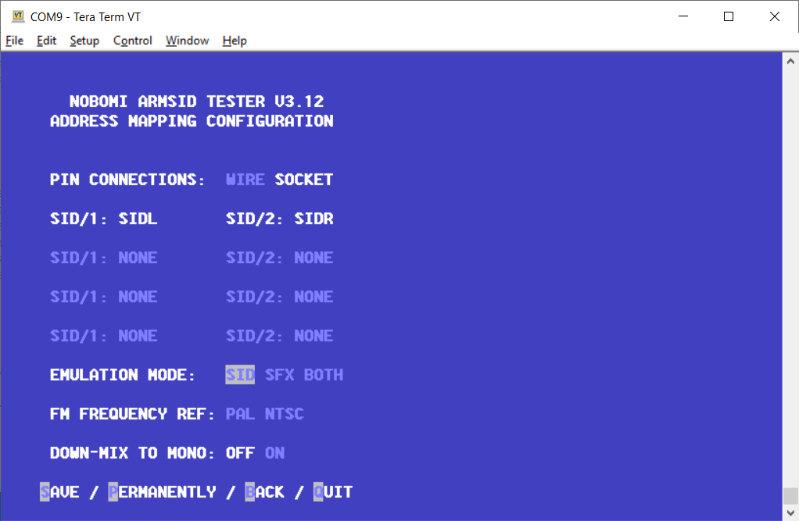

# Arduino ARMSID configurator

Simple Arduino shield with a sketch for ARMSID and ARM2SID configuration using Tera Term or similar ANSI terminal program. It allows:

- configure ARMSID or ARM2SID parameters (SID type, address mappings, filters, digifix, ...)
- update ARMSID or ARM2SID firmware
- play some SIDs to a headphone header (more than 60 ohms headphones only)

&nbsp;&nbsp;&nbsp;&nbsp;&nbsp;&nbsp;

#### ANSI terminal (Tera Term) configuration screen samples

&nbsp;&nbsp;&nbsp;&nbsp;

&nbsp;&nbsp;&nbsp;&nbsp;

### Schematic and PCB Layout

[Schematic](PCB/Arduino_AMRSID_tester_dual_sch.pdf)

[PCB Layout - Gerber files](PCB/Gerber/Arduino_AMRSID_tester_dual_Gerber.zip)

### Connectors

#### ARM2SID

Main DIL28 socket for ARMSID or ARM2SID to be configured.

#### SID2

DIL28 socket for the 2nd ARMSID or SID2 (ARM2SID). When using SID2, please use 6-pin PicoBlade connector with 5 cm wire to connect SID2 to ARM2SID.  

#### AUDIO1

Stereo audio output for headphones or amplifier line input.

Pin | Description     
--- | ---------------
Tip (the inner contact) | Output: Audio left (>60 ohms or line level)
Second row (the middle contact) | Output: Audio right (>60 ohms or line level)
Ring / Sleeve         |	Ground (GND)

Note: When connecting headphones, the impedance should be at least 60 ohm.
Note2: Shorten the connector legs near the board edge to not exceed the hole before soldering. Solder without creating solder (tin) bump, clean and cover with Kapton tape, as it could conflict with Arduino USB connector otherwise.

#### SOCKET (53047-06)

6-pin MOLEX PicoBlade connector for ARM2SID 2nd SID connection. Use 10 cm 6-pin PicoBlade connectors wire to ARM2SID instead of populating SID2 socket. 

Pin | Description     
--- | ---------------
1 | GND
2 | GND
3 |	Output: R/W (R/W signal for the 2nd socket)
4 |	Output: CS2 (CS signal for the 2nd socket)
5 | GND
6 | Input: Audio right

#### Arduino

Arduino pin headers used to connect to Arduino UNO. Only models with ATmega328P should be used, such as **Arduino UNO Rev3** or **Arduino UNO Rev3 SMD**.

### Bill of Materials

Component type | Reference         | Description                                | Quantity | Possible sources           | Notes
-------------- | ----------------- | ------------------------------------------ | -------- | -------------------------- | --------
PCB            |                   | Arduino ARMSID configurator shield PCB     | 1        | Order PCB or parts kit at [Retrocomp.cz e-shop](https://www.retrocomp.cz) or order from a PCB manufacturer of your choice using provided Gerber or Eagle files |  
Resistor       | R1, R2, R3, R4    | 110 kohm, SMD 0805                         | 4        | Digikey [RMCF0805FT110KCT-ND](https://www.digikey.com/product-detail/en/stackpole-electronics-inc/RMCF0805FT110K/RMCF0805FT110KCT-ND/2418241) | Needed only if you want to test POT inputs  
Capacitor      | C1, C2            | 100 nF, SMD 0805                           | 2        | Digikey [490-11955-1-ND](https://www.digikey.com/product-detail/en/murata-electronics/GCD21BR71H104KA01L/490-11955-1-ND/5403192) |  
Capacitor      | C3, C4, C5, C6    | 2.2 nF, SMD 0805                           | 4        | Digikey [490-6448-1-ND](https://www.digikey.com/product-detail/en/murata-electronics/GRM2165C2A222JA01D/490-6448-1-ND/3845645) | Needed only if you want to test POT inputs  
Capacitor      | C7, C8            | 10 uF, SMD 3528                            | 2        | Digikey [478-4975-1-ND](https://www.digikey.com/product-detail/en/avx-corporation/TPSB106M016R0800/478-4975-1-ND/1888186)      | Needed only if you want to use stereo audio output     
Capacitor      | C9, C10, C11, C12 | 15 nF, SMD 0805                            | 4        | Digikey [490-5718-1-ND](https://www.digikey.com/product-detail/en/murata-electronics/GR321AD72E153KW01D/490-5718-1-ND/2712261) | Needed only if you plan to use real SIDs (no sufficient power provided for real SIDs on current design)  
DIP/DIL Socket | ARM2SID, SID2     | 28 pin DIL socket (preferably ZIF)         | 2        | Digikey [3M2802-ND](https://www.digikey.cz/product-detail/cs/3m/228-1277-00-0602J/3M2802-ND/95268) or [A302-ND](https://www.digikey.cz/product-detail/cs/aries-electronics/28-6554-10/A302-ND/27592)  
Connector      | AUDIO1            | Audio connector JACK 3.5 mm - type FC68125 | 1        | Farnell [2309468](https://cz.farnell.com/cliff-electronic-components/fc68125/connector-phono-3-5mm-jack-4pole/dp/2309468)      | Needed only if you want to use stereo audio output  
Connector      | SOCKET            | Molex PicoBlade 6-pin vertical header      | 1        | Digikey [WM1735-ND](https://www.digikey.com/product-detail/en/molex/0530470610/WM1735-ND/242857)                               | Needed only if you want connect ARM2SID to board without SID2  
Connector      | B1                | Arduino stackable header kit               | 1        | Digikey [1568-1413-ND](https://www.digikey.com/product-detail/en/sparkfun-electronics/PRT-11417/1568-1413-ND/6161755)          |  
Arduino        | B1                | Arduino UNO Rev3                           | 1        | Digikey [1050-1041-ND](https://www.digikey.com/product-detail/end/arduino/A000073/1050-1041-ND/3476357) or [1050-1024-ND](https://www.digikey.com/product-detail/en/arduino/A000066/1050-1024-ND/2784006) |   

## Known Issues
* Version 1.0
  * 3.5 mm audio JACK touches the Arduino USB connector. Solder without tin bump and isolate with Kapton tape!
  * No power supply for real SIDs. The 5V provided is not sufficient for MOS 6581 nor 8580.  
